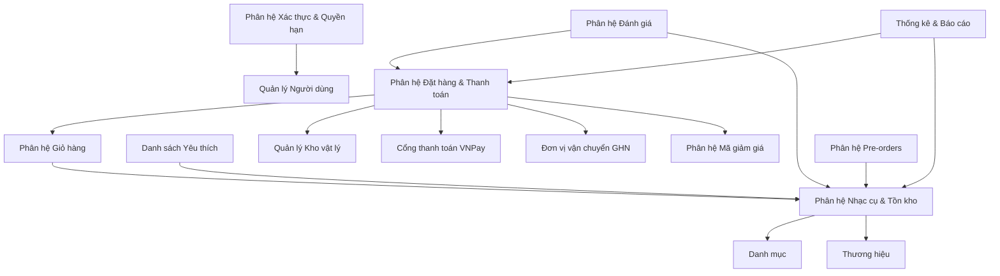

# TÀI LIỆU CHI TIẾT NGHIỆP VỤ HỆ THỐNG

## I. TỔNG QUAN KIẾN TRÚC MODULE
Hệ thống quản lý cửa hàng nhạc cụ SoundCraft được xây dựng theo mô hình ba lớp (Three-Tier Architecture) kết hợp kiến trúc hướng dịch vụ (Service-Oriented Architecture) phân tách rõ ràng giữa giao diện người dùng (Frontend - React + TypeScript) và logic nghiệp vụ phía máy chủ (Backend - NestJS + TypeScript + PostgreSQL). Dưới đây là các phân hệ nghiệp vụ chính của hệ thống và mối quan hệ phụ thuộc giữa chúng:



1. **Phân hệ Xác thực & Quyền hạn (Auth & Users)**: Đóng vai trò làm cổng bảo vệ hệ thống, quản lý thông tin tài khoản người dùng, phân quyền chi tiết (RBAC). Các phân hệ khác phụ thuộc vào Auth để xác thực danh tính người dùng qua JWT.
2. **Phân hệ Danh mục & Thương hiệu (Categories & Brands)**: Quản lý phân nhóm và thương hiệu nhạc cụ. Phân hệ Nhạc cụ (Products) phụ thuộc trực tiếp vào phân hệ này.
3. **Phân hệ Nhạc cụ & Tồn kho (Products & Inventory)**: Trọng tâm của hệ thống, quản lý chi tiết nhạc cụ, hình ảnh, tồn kho vật lý và logic bán. Phân hệ Giỏ hàng, Đặt hàng phụ thuộc vào Nhạc cụ để lấy thông tin giá cả, kiểm kho.
4. **Phân hệ Giỏ hàng & Yêu thích (Carts & Wishlists)**: Cho phép lưu trữ tạm thời các nhạc cụ người dùng muốn mua hoặc theo dõi. Phân hệ Giỏ hàng phụ thuộc vào Nhạc cụ và Tồn kho để xác thực tồn kho trước khi đặt hàng.
5. **Phân hệ Mã giảm giá (Coupons)**: Quản lý các chương trình ưu đãi, giảm giá. Phân hệ Đặt hàng phụ thuộc vào Coupons để tính toán lại tổng tiền thanh toán của đơn hàng.
6. **Phân hệ Đặt hàng & Thanh toán (Orders, VNPay & GHN)**: Xử lý quy trình mua hàng từ khi chọn sản phẩm, tính phí vận chuyển tự động qua GHN, thanh toán trực tuyến qua cổng VNPay, lưu đơn hàng và cập nhật trạng thái đơn hàng.
7. **Phân hệ Đánh giá (Reviews)**: Nhận phản hồi về chất lượng nhạc cụ từ khách hàng. Phụ thuộc vào phân hệ Đặt hàng (chỉ khách mua hàng mới được đánh giá) và phân hệ Nhạc cụ.
8. **Phân hệ Bài viết (Blogs)**: Hệ quản trị nội dung tin tức, kiến thức nhạc cụ, SEO hỗ trợ marketing.
9. **Phân hệ Thông báo (Notifications & Pre-orders)**: Gửi thông tin đẩy (in-app, mail) cho người dùng về đơn hàng hoặc khi sản phẩm được restock (Pre-order).
10. **Phân hệ Thống kê Doanh thu (Dashboard & Revenues)**: Phân tích, tổng hợp dữ liệu doanh thu, số lượng đơn hàng theo thời gian thực phục vụ admin quản trị.

---

## II. PHÂN TÍCH CHI TIẾT THEO TỪNG MODULE

### 1. Phân hệ Xác thực & Quản lý Người dùng (Auth & Users)
- **Tác nhân (Actors) liên quan:** Khách viếng thăm (Guest), Khách hàng (Customer), Quản lý (Manager), Nhân viên (Staff), Quản trị viên (Admin/Owner/Super Admin).
- **Luồng xử lý nghiệp vụ (End-to-End Workflow):**
  * *Bắt đầu từ UI React:* Người dùng điền thông tin vào form tại trang đăng ký hoặc đăng nhập (`SignupPage.tsx` hoặc `Login.tsx`), nhấn nút "Đăng ký" / "Đăng nhập" hoặc "Đăng nhập bằng Google".
  * *API Endpoint NestJS tiếp nhận:* `POST /auth/register` (đăng ký), `POST /auth/login` (đăng nhập truyền thống), `POST /auth/login/social/google` (đăng nhập Google), `POST /auth/forgot-password` (yêu cầu OTP), `POST /auth/reset-password` (đổi mật khẩu bằng OTP).
  * *Data luân chuyển qua Backend:*
    * *Đăng nhập truyền thống:* `AuthController.login` tiếp nhận `LoginDto`. `AuthService.login` gọi `UsersService.findUserByEmail` để kiểm tra tài khoản. Dùng `bcrypt.compare` để so khớp mật khẩu đã hash trong DB.
    * *Đăng ký:* `AuthController.register` tiếp nhận `RegisterDto`. `AuthService.register` gọi `UsersService.createUser` thực hiện kiểm tra trùng lặp email và lưu vào DB.
    * *Quên & đặt lại mật khẩu:* Khách hàng nhập email yêu cầu OTP gửi qua `POST /auth/forgot-password`. `UsersService.requestForgotPassword` sinh mã OTP 6 chữ số ngẫu nhiên, cài thời gian hết hạn 15 phút, lưu vào các trường ẩn của user trong DB rồi gửi email thông qua `MailerService`. Khách hàng điền OTP và mật khẩu mới gửi qua `POST /auth/reset-password`. `UsersService.resetPasswordWithOtp` kiểm tra so khớp mã OTP và hạn dùng, mã hóa mật khẩu mới và lưu vào DB.
    * *Kịch bản thành công:* Hệ thống tạo Access Token (hết hạn trong 15 phút) gửi về cho Client trong response body và Refresh Token (hết hạn trong 7 ngày) gửi về dạng HttpOnly Cookie, đồng thời lưu Refresh Token vào bảng `tokens`.
    * *Kịch bản thất bại:* Sai thông tin mật khẩu/tài khoản ném ra lỗi `UnauthorizedException(401)`. Tài khoản bị khóa ném ra lỗi `BadRequestException(400)`. OTP sai hoặc hết hạn ném ra lỗi `BadRequestException(400)`.
- **Nghiệp vụ Quản lý (CRUD & State Management):**
  * *Trạng thái người dùng:* `is_active` (true - Đang hoạt động, false - Đã khóa).
  * *Điều kiện chuyển trạng thái:* Tài khoản khách hàng có thể bị khóa hoặc mở bởi Admin/Owner/Super Admin thông qua trang quản lý khách hàng (`CustomerList.tsx`). API tương ứng là `PUT /users/admin/:id` (`updateUserByAdmin`).
  * *Phân quyền vai trò (Role):* Khách hàng mới mặc định nhận vai trò `ROLE_CUSTOMER`. Nhân viên bán hàng nhận vai trò `ROLE_STAFF`, quản lý nhận vai trò `ROLE_MANAGER`, quản trị cao cấp nhận vai trò `ROLE_ADMIN` / `ROLE_OWNER` / `ROLE_SUPER_ADMIN`.
- **Nghiệp vụ Áp dụng & Tính toán (Core Logic):**
  * *Thuật toán băm mật khẩu:* Sử dụng `bcrypt` mã hóa mật khẩu một chiều với salt rounds = 10.
  * *Xử lý Token:* Sử dụng cơ chế Refresh Token Rotation (RTR). Khi người dùng gọi API làm mới token (`GET /auth/refresh-token`), Refresh Token cũ sẽ bị thu hồi (`revoked = true`) và lưu cặp token mới để tránh replay attack.
- **Kiểm tra điều kiện & Ràng buộc (Validation & Constraints):**
  * **Validation tại Frontend:**
    | Trường dữ liệu | Quy tắc validation trên Form React |
    | :--- | :--- |
    | Email | Bắt buộc nhập, đúng định dạng Email (Regex: `^\S+@\S+\.\S+$`) |
    | Mật khẩu | Bắt buộc nhập, độ dài tối thiểu 5 ký tự |
    | Số điện thoại | Độ dài từ 10 - 11 chữ số, chỉ chứa ký tự số |
  * **Validation tại Backend:**
    * Sử dụng DTO (`RegisterDto`, `LoginDto`, `ResetPasswordDto`) kết hợp `class-validator`: `@IsEmail()`, `@IsNotEmpty()`, `@MinLength(5)`, `@Matches(/^[0-9]{6}$/)` cho OTP.
    * Database validation: Kiểm tra duy nhất (Unique Constraint) đối với trường `email` và `mobile`.
  * **Ràng buộc logic (Business Rules):**
    * Ràng buộc tuổi tác: Khi khách hàng chỉnh sửa hồ sơ cập nhật ngày sinh (`dob`), Backend tính tuổi:
      $$Age = Year(Current) - Year(DOB)$$
      Nếu $Age < 18$, ném lỗi `BadRequestException('Người dùng phải từ 18 tuổi trở lên')`.
    * Ràng buộc quyền hạn Admin: Quản lý (`MANAGER`) chỉ được tạo/sửa/xóa tài khoản của Nhân viên (`STAFF`). Admin/Owner không được thao tác trên tài khoản của Super Admin.

---

### 2. Phân hệ Quản lý Danh mục & Thương hiệu (Categories & Brands)
- **Tác nhân (Actors) liên quan:** Khách viếng thăm (Guest), Khách hàng (Customer), Nhân viên (Staff), Quản trị viên (Admin/Owner/Super Admin).
- **Luồng xử lý nghiệp vụ (End-to-End Workflow):**
  * *Bắt đầu từ UI React:*
    * Khách hàng lọc nhạc cụ theo danh mục hoặc thương hiệu tại trang sản phẩm (`Products.tsx`) hoặc xem biểu trưng thương hiệu tại trang chủ (`Home.tsx`).
    * Admin truy cập danh mục quản trị tại `/admin/categories` (`CategoryList.tsx`, `AddCategory.tsx`, `EditCategory.tsx`) hoặc `/admin/brands` (`BrandList.tsx`, `BrandAddEdit.tsx`), điền thông tin và tải logo/ảnh lên.
  * *API Endpoint NestJS tiếp nhận:* `GET /categories` / `GET /brands` (danh sách công khai), `POST /categories` / `POST /brands` (tạo mới của Admin), `PUT /categories/:id` / `PUT /brands/:id` (cập nhật), `DELETE /categories/:id` / `DELETE /brands/:id` (xóa).
  * *Data luân chuyển qua Backend:* Admin gửi dữ liệu form có kèm file logo thương hiệu -> NestJS dùng `FileInterceptor('file')` tiếp nhận -> `BrandsService` xử lý upload ảnh lên Cloudinary qua `CloudinaryService.uploadImageBrands` -> Lưu thực thể `Brand` hoặc `Category` vào DB.
    * *Kịch bản thành công:* Lưu cơ sở dữ liệu thành công, trả về HTTP status 201 (tạo mới) hoặc 200 (cập nhật).
    * *Kịch bản thất bại:* Trùng tên/slug ném ra lỗi `ConflictException(409)`. Không tải lên logo khi tạo thương hiệu ném ra lỗi `BadRequestException(400)`.
- **Nghiệp vụ Quản lý (CRUD & State Management):**
  * Danh mục và thương hiệu chỉ có trạng thái cơ bản hoặc trạng thái hoạt động mặc định. Admin có toàn quyền tạo mới, chỉnh sửa thông tin chi tiết và xóa bỏ.
- **Nghiệp vụ Áp dụng & Tính toán (Core Logic):**
  * *Tự động tạo Slug:* Chuyển đổi tên danh mục/thương hiệu tiếng Việt có dấu thành chuỗi slug không dấu phục vụ cho đường dẫn thân thiện SEO (Ví dụ: "Đàn Guitar Classic" thành `dan-guitar-classic`) bằng thư viện `slugify`.
- **Kiểm tra điều kiện & Ràng buộc (Validation & Constraints):**
  * **Validation tại Frontend:**
    | Trường dữ liệu | Quy tắc validation trên Form React |
    | :--- | :--- |
    | Tên danh mục/thương hiệu | Bắt buộc nhập, không được để trống, độ dài từ 2 đến 100 ký tự |
    | Slug | Tự động sinh từ tên hoặc cho phép tự nhập, chỉ chứa chữ thường, số, dấu gạch ngang |
  * **Validation tại Backend:**
    * DTO: `@IsString()`, `@IsNotEmpty()`, `@Length(2, 100)`.
  * **Ràng buộc logic (Business Rules):**
    * Ràng buộc khóa ngoại an toàn: Tại Entity `Product`, các trường liên kết `brand` và `category` được thiết lập tùy chọn `{ onDelete: 'SET NULL' }`. Khi Admin xóa một danh mục hoặc thương hiệu, toàn bộ nhạc cụ thuộc danh mục/thương hiệu đó không bị xóa dây chuyền, mà các cột khóa ngoại tương ứng sẽ chuyển về giá trị `null`.

---

### 3. Phân hệ Nhạc cụ & Tồn kho (Products & Inventory)
- **Tác nhân (Actors) liên quan:** Khách hàng (Customer), Nhân viên (Staff), Quản trị viên (Admin/Owner/Super Admin).
- **Luồng xử lý nghiệp vụ (End-to-End Workflow):**
  * *Bắt đầu từ UI React:*
    * Khách hàng xem danh sách nhạc cụ tại trang sản phẩm, nhấp xem chi tiết tại trang `/products/:id` (`ProductDetail.tsx`).
    * Admin truy cập quản lý sản phẩm tại trang `/admin/products` (`ProductList.tsx`), nhập thông tin form (tên nhạc cụ, giá bán, giá gốc, tồn kho, giới hạn đặt hàng, mô tả), tải ảnh thumbnail và mảng ảnh gallery chi tiết.
  * *API Endpoint NestJS tiếp nhận:* `GET /products` (phân trang và lọc nâng cao), `GET /products/:id` (chi tiết nhạc cụ), `POST /products` (tạo nhạc cụ), `PUT /products/:id` (cập nhật), `DELETE /products/:id` (xóa).
  * *Data luân chuyển qua Backend:*
    * *Tạo nhạc cụ:* `ProductsController.create` sử dụng `FileFieldsInterceptor` để nhận ảnh `thumbnail` và ảnh `gallery` cùng lúc. `ProductsService.createProduct` upload các file này lên Cloudinary qua `CloudinaryService.uploadImageProducts`, sau đó mở Transaction lưu Product Entity và các ProductImage Entity vào DB.
    * *Cập nhật:* `ProductsController.update` tiếp nhận `retainedImagesJson` (mảng ID ảnh cũ muốn giữ lại). `ProductsService.updateProduct` lọc ra các ảnh bị xóa, tiến hành xóa bản ghi tương ứng trong DB và xóa file ảnh trên Cloudinary ngầm qua Public ID, đồng thời lưu các ảnh mới thêm.
    * *Kịch bản thành công:* Lưu dữ liệu và trả về thực thể sản phẩm kèm theo danh sách hình ảnh đã mapping.
    * *Kịch bản thất bại:* Giá bán lớn hơn giá gốc ném ra lỗi `BadRequestException(400)`. Không có ảnh thumbnail khi tạo mới ném ra lỗi `BadRequestException(400)`.
- **Nghiệp vụ Quản lý (CRUD & State Management):**
  * *Trạng thái nhạc cụ:* `status` (ACTIVE - Đang bán, INACTIVE - Ngừng kinh doanh).
  * *Tồn kho vật lý:* `stock_quantity` (số lượng tồn kho thực tế). Trạng thái tồn kho `is_stock` tự động trả về `true` nếu `stock_quantity > 0` hoặc bằng `-1` (vô hạn), ngược lại trả về `false` (Hết hàng).
- **Nghiệp vụ Áp dụng & Tính toán (Core Logic):**
  * *Kiểm tra Tồn kho vô hạn:* Hệ thống hỗ trợ nghiệp vụ bán sản phẩm số hoặc đặt trước không giới hạn bằng cách đặt `stock_quantity = -1`. Khi đó, hệ thống sẽ bỏ qua logic trừ tồn kho.
  * *Lọc sản phẩm động:* Sử dụng TypeORM QueryBuilder xây dựng câu truy vấn SQL động lọc theo khoảng giá, danh mục, thương hiệu và từ khóa cùng lúc, có hỗ trợ phân trang (`page`, `limit`).
- **Kiểm tra điều kiện & Ràng buộc (Validation & Constraints):**
  * **Validation tại Frontend:**
    | Trường dữ liệu | Quy tắc validation trên Form React |
    | :--- | :--- |
    | Tên nhạc cụ | Bắt buộc nhập, độ dài từ 5 đến 200 ký tự |
    | Giá bán / Giá gốc | Bắt buộc nhập, là số dương, giá bán không lớn hơn giá gốc |
    | Tồn kho | Bắt buộc nhập, là số nguyên lớn hơn hoặc bằng -1 |
  * **Validation tại Backend:**
    * DTO Validation: `@IsNotEmpty()`, `@IsNumberString()`, `@Min(0)` cho giá, `@IsInt()` cho tồn kho.
  * **Ràng buộc logic (Business Rules):**
    * Ràng buộc giá trị tài chính: Giá bán thực tế của nhạc cụ (`price`) không bao giờ được phép lớn hơn giá gốc trước khi giảm (`original_price`).
      $$Price \le OriginalPrice$$
    * Thu dọn rác Cloud: Khi xóa sản phẩm hoặc cập nhật ảnh mới, toàn bộ ảnh cũ bị thay thế bắt buộc phải được gọi xóa khỏi Cloudinary qua Public ID để tiết kiệm tài nguyên đám mây.

---

### 4. Phân hệ Giỏ hàng & Yêu thích (Carts & Wishlists)
- **Tác nhân (Actors) liên quan:** Khách hàng đã đăng nhập (Customer).
- **Luồng xử lý nghiệp vụ (End-to-End Workflow):**
  * *Bắt đầu từ UI React:* Khách hàng nhấn "Thêm vào giỏ hàng" tại trang sản phẩm, thay đổi số lượng, nhập ghi chú tại trang giỏ hàng `/cart` (`Cart.tsx`), hoặc click icon hình trái tim để thêm vào danh sách yêu thích `/wishlist` (`Wishlist.tsx`).
  * *API Endpoint NestJS tiếp nhận:* `GET /carts` (lấy giỏ hàng), `POST /carts/items` (upsert giỏ hàng), `PUT /carts/items/:itemId/quantity` (cập nhật số lượng), `PUT /carts/items/:itemId/note` (cập nhật ghi chú), `DELETE /carts/items/:itemId` (xóa item), `POST /wishlists/toggle` (thêm/xóa yêu thích).
  * *Data luân chuyển qua Backend:*
    * *Thêm vào giỏ hàng:* `CartsController.upsertCartItem` tiếp nhận `UpsertCartItemDto`. `CartService.upsertCartItem` tìm kiếm giỏ hàng của user. Cộng dồn số lượng nếu sản phẩm đã có trong giỏ.
    * Gọi hàm `validateInventoryAndLimit` kiểm tra tính hợp lệ của sản phẩm và giới hạn đặt mua của nhạc cụ. Lưu thay đổi vào DB.
    * *Kịch bản thành công:* Trả về chi tiết giỏ hàng mới cập nhật kèm tổng tiền và thông tin từng mặt hàng.
    * *Kịch bản thất bại:* Hết hàng ném lỗi `InsufficientStockException`. Sản phẩm bị ẩn ném lỗi `ProductBannedException`. Vượt giới hạn mua ném lỗi `MaxOrderQuantityExceededException`.
- **Nghiệp vụ Quản lý (CRUD & State Management):**
  * Giỏ hàng gắn liền OneToOne với tài khoản User. Bản ghi `CartItem` được tạo, cập nhật số lượng hoặc xóa đi khi khách hàng tương tác trực tiếp trên giao diện giỏ hàng.
- **Nghiệp vụ Áp dụng & Tính toán (Core Logic):**
  * *Cơ chế Vô hiệu hóa mềm (Soft Disable):* Khi truy xuất giỏ hàng qua `getCart`, hệ thống không tự ý xóa sản phẩm đã bị thay đổi ở trang quản trị.
    * Nếu sản phẩm có trạng thái khác `ACTIVE` -> Đánh dấu `isAvailable = false`, `disableReason = 'Sản phẩm tạm ngưng hoạt động'`.
    * Nếu tồn kho thực tế khả dụng $\le 0$ (và không phải tồn kho vô hạn `-1`) -> Đánh dấu `isAvailable = false`, `disableReason = 'Hết hàng'`.
    * *Tính tiền giỏ hàng:* Hệ thống chỉ cộng dồn thành tiền từ các item có `isAvailable = true`:
      $$TotalCartMoney = \sum (CartItem.quantity \times Product.price) \quad \text{với } CartItem.isAvailable = true$$
- **Kiểm tra điều kiện & Ràng buộc (Validation & Constraints):**
  * **Validation tại Frontend:**
    | Trường dữ liệu | Quy tắc validation trên Form React |
    | :--- | :--- |
    | Số lượng mua | Bắt buộc nhập, phải là số nguyên dương lớn hơn hoặc bằng 1 |
    | Ghi chú | Tùy chọn, tối đa 200 ký tự |
  * **Validation tại Backend:**
    * DTO: `@IsInt()`, `@Min(1)` cho quantity, `@IsString()`, `@IsOptional()` cho ghi chú.
  * **Ràng buộc logic (Business Rules):**
    * Khi số lượng khách đặt mua lớn hơn số lượng tồn kho khả dụng hiện tại hoặc lớn hơn thuộc tính `max_order_quantity` của sản phẩm đó, Backend lập tức từ chối và chặn thanh toán.

---

### 5. Phân hệ Mã giảm giá (Coupons)
- **Tác nhân (Actors) liên quan:** Khách hàng (Customer), Quản trị viên (Admin/Owner/Super Admin).
- **Luồng xử lý nghiệp vụ (End-to-End Workflow):**
  * *Bắt đầu từ UI React:* Tại màn hình thanh toán đơn hàng (`Checkout.tsx`), khách hàng nhập mã giảm giá vào ô nhập mã và nhấn nút "Áp dụng".
  * *API Endpoint NestJS tiếp nhận:* `GET /coupons/available` (lấy mã còn hạn), `POST /coupons/apply-preview` (áp thử xem trước số tiền giảm), `POST /coupons/checkout/commit` (chốt sử dụng mã sau khi tạo đơn hàng thành công).
  * *Data luân chuyển qua Backend:*
    * *Áp thử mã:* `CouponsController.applyPreview` tiếp nhận `ApplyCouponPreviewDto`. `CouponsService.applyCouponPreview` gọi hàm xác thực mã `validateCouponForApply` kiểm tra mã hoạt động, thời hạn hiệu lực, số lần dùng còn lại trên toàn hệ thống và số lần dùng của riêng user.
    * Tiến hành tính số tiền chiết khấu tùy thuộc loại giảm giá (phần trăm hoặc cố định).
    * *Kịch bản thành công:* Trả về chi tiết: tổng tiền giỏ hàng, số tiền được giảm và tổng tiền sau giảm giá.
    * *Kịch bản thất bại:* Mã hết lượt dùng hoặc chưa đạt giá trị đơn hàng tối thiểu ném ra lỗi `BadRequestException(400)`.
- **Nghiệp vụ Quản lý (CRUD & State Management):**
  * *Trạng thái mã giảm giá:* `is_active` (true - Đang mở, false - Khóa). Admin có quyền bật/tắt trạng thái hoạt động của mã qua API `/coupons/admin/:id/toggle-active`.
- **Nghiệp vụ Áp dụng & Tính toán (Core Logic):**
  * *Thuật toán tính chiết khấu đơn hàng:*
    * Nếu loại giảm giá là `FIXED` (Số tiền cố định):
      $$DiscountAmount = Min(DiscountValue, TotalCartAmount)$$
    * Nếu loại giảm giá là `PERCENT` (Phần trăm):
      $$RawDiscount = \frac{TotalCartAmount \times DiscountValue}{100}$$
      $$DiscountAmount = Min(RawDiscount, MaxDiscountAmount)$$
- **Kiểm tra điều kiện & Ràng buộc (Validation & Constraints):**
  * **Validation tại Frontend:**
    | Trường dữ liệu | Quy tắc validation trên Form React |
    | :--- | :--- |
    | Mã giảm giá | Bắt buộc nhập, viết hoa, không chứa khoảng trắng hay ký tự đặc biệt |
  * **Validation tại Backend:**
    * DTO Validation: `@IsString()`, `@IsNotEmpty()` cho mã coupon. `@IsNumber()` cho tổng tiền đơn hàng.
    * *Ràng buộc tạo mã của Admin:*
      * Giảm cố định: Số tiền giảm phải nhỏ hơn giá trị đơn hàng tối thiểu (`discountValue < minOrderAmount`).
      * Giảm phần trăm: Giá trị giảm phải nằm trong khoảng `[1, 100]` và bắt buộc phải điền Số tiền giảm tối đa (`maxDiscountAmount`).
  * **Ràng buộc logic (Business Rules):**
    * Chặn sử dụng: Khách hàng không được dùng mã giảm giá vượt quá hạn mức cá nhân quy định tại `max_usage_per_user` (kiểm tra bằng cách đếm số lượt đã lưu trong bảng `coupon_usages` liên quan đến user đó).

---

### 6. Phân hệ Đặt hàng, Vận chuyển & Thanh toán (Checkout, Orders, GHN & VNPay)
- **Tác nhân (Actors) liên quan:** Khách hàng (Customer), Nhân viên (Staff), Quản trị viên (Admin), VNPay Gateway, Giao Hàng Nhanh (GHN), Hệ thống Cron Job.
- **Luồng xử lý nghiệp vụ (End-to-End Workflow):**
  * *Bắt đầu từ UI React:* Khách hàng chọn các sản phẩm cần mua trong giỏ, chọn địa chỉ giao nhận và phương thức thanh toán (COD hoặc VNPAY) tại trang `/checkout` (`Checkout.tsx`), nhấn nút "Đặt hàng".
  * *API Endpoint NestJS tiếp nhận:* `POST /orders/checkout` (tạo đơn), `GET /orders/vnpay/ipn` (nhận webhook VNPay), `POST /orders/:id/cancel` (hủy đơn), `POST /orders/:id/confirm-receipt` (xác nhận nhận hàng).
  * *Data luân chuyển qua Backend:*
    * *Tạo đơn hàng:* `OrdersController.checkout` gọi `OrdersService.checkout` chạy trong **Database Transaction**:
      1. Gọi `AddressService.getAddressById` xác thực địa chỉ nhận hàng thuộc về user.
      2. Gọi API của GHN (`calculateShippingFee`) để lấy phí vận chuyển thời gian thực dựa trên quận/huyện nhận và trọng lượng nhạc cụ.
      3. Kiểm tra sản phẩm và trừ tồn kho vật lý qua `InventoryService.deductStock`.
      4. Áp dụng mã giảm giá và tính toán tổng tiền đơn hàng.
      5. Tạo bản ghi đơn hàng `Order` (status `PENDING`, payment_status `UNPAID`) và các chi tiết `OrderItem` tương ứng.
      6. Làm trống các sản phẩm đã mua khỏi giỏ hàng.
      7. Nếu thanh toán bằng **VNPAY**: Gọi `VnpayService.createPaymentUrl` tạo link thanh toán gửi về cho Frontend chuyển hướng người dùng.
      8. Nếu thanh toán bằng **COD**: Hoàn tất transaction và gửi thông báo đặt đơn thành công.
    * *Kịch bản thành công:* Tạo đơn hàng thành công, trừ kho thành công, chuyển hướng thanh toán an toàn.
    * *Kịch bản thất bại:* Tồn kho không đủ hoặc sản phẩm bị ẩn ném lỗi `BadRequestException`. Có lỗi xảy ra trong tiến trình, hệ thống rollback toàn bộ transaction lưu trữ, khôi phục tồn kho nguyên vẹn.
- **Nghiệp vụ Quản lý (CRUD & State Management):**
  * *Trạng thái Đơn hàng (OrderStatus):*
    ```mermaid
    stateDiagram-v2
        [*] --> PENDING : Đặt hàng thành công
        PENDING --> PACKING : Admin chuẩn bị hàng
        PENDING --> CANCELLED : Khách hủy / Admin hủy
        PACKING --> SHIPPING : Bàn giao vận chuyển
        SHIPPING --> DELIVERED : Giao hàng thành công
        DELIVERED --> COMPLETED : Xác nhận nhận hàng / Hệ thống tự hoàn thành (3 ngày)
    ```
  * *Trạng thái Thanh toán (PaymentStatus):* `UNPAID` (Chưa trả tiền) -> `PAID` (Đã thanh toán).
  * *Điều kiện chuyển trạng thái:*
    * Khách hàng chỉ được phép hủy đơn khi trạng thái là `PENDING`. Khách hàng chuyển đơn từ `DELIVERED` sang `COMPLETED` bằng nút "Đã nhận hàng".
    * Admin cập nhật trạng thái đơn hàng theo lộ trình qua màn hình `/admin/orders` (`OrderList.tsx`). API: `POST /orders/admin/:id/status`. Khi Admin chuyển trạng thái sang `COMPLETED`, hệ thống tự cập nhật `payment_status = 'PAID'`.
- **Nghiệp vụ Áp dụng & Tính toán (Core Logic):**
  * *Công thức tính tổng tiền đơn hàng:*
    $$TotalAmount = \sum (Quantity \times Price) - CouponDiscount + ShippingFee$$
  * *Tính phí vận chuyển qua GHN:* Backend gọi API của GHN lấy thông tin dịch vụ khả dụng và tính phí. Nếu API GHN bị lỗi, hệ thống tự kích hoạt mức phí dự phòng là `35,000 VND`.
- **Kiểm tra điều kiện & Ràng buộc (Validation & Constraints):**
  * **Validation tại Frontend:**
    | Trường dữ liệu | Quy tắc validation trên Form React |
    | :--- | :--- |
    | Địa chỉ nhận hàng | Bắt buộc chọn từ danh sách địa chỉ đã lưu hoặc tạo mới |
    | Phương thức thanh toán | Bắt buộc chọn (COD hoặc VNPAY) |
  * **Validation tại Backend:**
    * DTO: `CheckoutRequestDto` bắt buộc có `selectedItems` (mảng đối tượng chứa ID và số lượng), `addressId` là số nguyên, `paymentMethod` thuộc enum phương thức.
  * **Ràng buộc logic (Business Rules):**
    * Khi đơn hàng bị hủy, hệ thống tự động hoàn lại tồn kho thực tế qua `InventoryService.releaseStock`.
    * Idempotency check tại IPN: Nếu đơn hàng đã nhận được trạng thái `PAID` từ trước, IPN lập tức trả về mã thành công `00` và bỏ qua các xử lý sau để chống lặp giao dịch.
    * Tự động hoàn thành đơn hàng: Cron Job tự động hoàn tất các đơn hàng giao thành công (`DELIVERED`) sau 3 ngày không phát sinh khiếu nại.

---

### 7. Phân hệ Đánh giá sản phẩm (Reviews)
- **Tác nhân (Actors) liên quan:** Khách hàng đã mua nhạc cụ (Customer), Quản trị viên (Admin/Super Admin).
- **Luồng xử lý nghiệp vụ (End-to-End Workflow):**
  * *Bắt đầu từ UI React:* Tại trang chi tiết đơn hàng đã giao thành công, khách hàng chọn số sao đánh giá (1-5), nhập nội dung bình luận, chọn tối đa 5 hình ảnh thực tế và bấm nút "Gửi đánh giá".
  * *API Endpoint NestJS tiếp nhận:* `POST /reviews` (gửi đánh giá), `PATCH /reviews/:id` (chỉnh sửa), `DELETE /reviews/:id` (người dùng tự xóa), `PATCH /reviews/:id/approve` (admin duyệt), `PATCH /reviews/:id/hide` (admin ẩn).
  * *Data luân chuyển qua Backend:* Khách hàng gửi form multipart -> NestJS dùng `FilesInterceptor('images', 5)` nhận ảnh -> `ReviewsService.create` kiểm tra rating, quét bộ lọc từ ngữ vi phạm, kiểm tra đánh giá trùng lặp. Lưu bản ghi vào DB với trạng thái `PENDING`. Upload ảnh lên Cloudinary và lưu link vào bảng `review_images`. Cập nhật trạng thái `is_reviewed = true` cho chi tiết đơn hàng.
    * *Kịch bản thành công:* Lưu đánh giá thành công, hiển thị thông báo cảm ơn khách hàng.
    * *Kịch bản thất bại:* Trùng đánh giá hoặc chứa từ ngữ cấm ném lỗi `BadRequestException(400)`. Sửa đánh giá quá hạn 7 ngày ném lỗi `BadRequestException(400)`.
- **Nghiệp vụ Quản lý (CRUD & State Management):**
  * *Trạng thái đánh giá:* `review_status` (PENDING - Chờ duyệt, PUBLISHED - Đã xuất bản/Hiển thị công khai, HIDDEN - Đã ẩn do vi phạm). Đánh giá sau khi tạo luôn ở trạng thái `PENDING` và chỉ được hiển thị ngoài client sau khi Admin duyệt qua trang `/admin/reviews` (`ReviewManagement.tsx`).
- **Nghiệp vụ Áp dụng & Tính toán (Core Logic):**
  * *Thuật toán tính điểm đánh giá trung bình:* Lấy trung bình cộng số sao của toàn bộ các đánh giá có trạng thái `PUBLISHED` thuộc sản phẩm:
    $$AverageRating = \frac{\sum (Rating)}{TotalPublishedReviews}$$
    Hệ thống làm tròn điểm số đến 1 chữ số thập phân (Ví dụ: 4.8 sao) và trả về số lượng chi tiết của từng mức đánh giá từ 1 đến 5 sao phục vụ hiển thị biểu đồ sao.
- **Kiểm tra điều kiện & Ràng buộc (Validation & Constraints):**
  * **Validation tại Frontend:**
    | Trường dữ liệu | Quy tắc validation trên Form React |
    | :--- | :--- |
    | Số sao (Rating) | Bắt buộc chọn từ 1 đến 5 sao |
    | Nội dung bình luận | Tùy chọn, tối đa 500 ký tự |
    | Hình ảnh đính kèm | Tối đa 5 file, định dạng ảnh (.jpg, .png, .webp) |
  * **Validation tại Backend:**
    * DTO: `CreateReviewDto` bắt buộc có `product_id`, `rating` từ 1-5 sao.
  * **Ràng buộc logic (Business Rules):**
    * Bộ lọc từ ngữ vi phạm: Từ chối lưu đánh giá nếu phát hiện chứa từ ngữ thuộc danh sách từ nhạy cảm (`badWords = ['chửi', 'bậy', 'xấu', 'tệ']`).
    * Hạn chế chỉnh sửa: Khách hàng chỉ được phép chỉnh sửa hoặc cập nhật lại đánh giá của mình trong thời gian tối đa 7 ngày kể từ khi tạo.

---

### 8. Phân hệ Quản lý Bài viết (Blogs)
- **Tác nhân (Actors) liên quan:** Khách viếng thăm (Guest), Nhân viên (Staff), Quản trị viên (Admin/Owner/Super Admin).
- **Luồng xử lý nghiệp vụ (End-to-End Workflow):**
  * *Bắt đầu từ UI React:*
    * Khách hàng truy cập trang tin tức tại `/blog` (`BlogList.tsx`) hoặc nhấp xem chi tiết bài viết tại `/blog/:slug` (`BlogDetail.tsx`).
    * Admin thực hiện quản lý bài viết tại `/admin/blogs` (`AdminBlogList.tsx`, `AdminBlogAddEdit.tsx`), nhập tiêu đề, mô tả ngắn, nội dung chi tiết và tải ảnh bìa lên.
  * *API Endpoint NestJS tiếp nhận:* `GET /blogs` (danh sách công khai bài viết), `GET /blogs/:slug` (chi tiết bài viết theo slug), `POST /blogs/admin` (tạo bài viết), `PUT /blogs/admin/:id` (cập nhật), `DELETE /blogs/admin/:id` (xóa).
  * *Data luân chuyển qua Backend:*
    * *Đọc bài viết:* `BlogsController.getBlogBySlug` tiếp nhận slug -> `BlogsService.getBlogBySlug` tìm kiếm bài viết có trạng thái `PUBLISHED` -> Gọi lệnh `increment` tăng view trực tiếp dưới DB -> Trả về bài viết chi tiết.
    * *Tạo mới:* Admin gửi form -> Backend upload ảnh lên Cloudinary -> Sinh slug tự động -> Lưu bài viết dưới trạng thái nháp `DRAFT`.
    * *Kịch bản thành công:* Trả về thông tin bài viết chi tiết hoặc thông báo tạo/sửa thành công.
    * *Kịch bản thất bại:* Không tìm thấy bài viết hoặc bài viết bị ẩn ném lỗi `NotFoundException(404)`.
- **Nghiệp vụ Quản lý (CRUD & State Management):**
  * *Trạng thái bài viết:* `status` (DRAFT - Bản nháp, PUBLISHED - Đã xuất bản, HIDDEN - Đã ẩn).
  * *Điều kiện chuyển trạng thái:* Bài viết được tạo mặc định ở dạng `DRAFT`. Admin nhấn nút "Xuất bản" trên giao diện quản trị để chuyển trạng thái sang `PUBLISHED` (API: `PUT /blogs/admin/:id/publish`), lúc này hệ thống sẽ tự động gán thời gian xuất bản `published_at = new Date()`.
- **Nghiệp vụ Áp dụng & Tính toán (Core Logic):**
  * *Tăng view đếm lượt đọc:* Để ngăn ngừa Race Condition khi nhiều người truy cập đọc bài viết cùng một thời điểm, hệ thống cập nhật số lượt xem thông qua lệnh nguyên tử (Atomic Update) trực tiếp dưới DB:
    ```typescript
    await this.blogRepo.increment({ blog_id: blog.blog_id }, 'view_count', 1);
    ```
- **Kiểm tra điều kiện & Ràng buộc (Validation & Constraints):**
  * **Validation tại Frontend:**
    | Trường dữ liệu | Quy tắc validation trên Form React |
    | :--- | :--- |
    | Tiêu đề bài viết | Bắt buộc nhập, độ dài từ 10 đến 150 ký tự |
    | Nội dung bài viết | Bắt buộc nhập, không được để trống |
    | Ảnh bìa | Bắt buộc tải lên khi tạo mới bài viết |
  * **Validation tại Backend:**
    * DTO: `@IsNotEmpty()`, `@Length(10, 150)` cho tiêu đề.
  * **Ràng buộc logic (Business Rules):**
    * Độc nhất Slug: Nếu slug tạo từ tiêu đề trùng lặp với slug đã có trong DB, Backend tự động ghép thêm dấu gạch nối và timestamp hệ thống (`${baseSlug}-${Date.now()}`) vào đuôi để đảm bảo URL bài viết luôn độc nhất.
    * Xóa bài viết sẽ tự động thực hiện xóa ảnh bìa liên kết trên Cloudinary ngầm qua Public ID.

---

### 9. Phân hệ Đăng ký nhận thông báo có hàng (Pre-orders)
- **Tác nhân (Actors) liên quan:** Khách hàng (Customer), Quản trị viên (Admin/System).
- **Luồng xử lý nghiệp vụ (End-to-End Workflow):**
  * *Bắt đầu từ UI React:* Khi xem trang chi tiết nhạc cụ có số lượng tồn kho bằng 0, nút "Mua hàng" được ẩn đi và thay thế bằng nút "Nhận thông báo khi có hàng". Khách hàng điền thông tin liên hệ và bấm gửi đăng ký.
  * *API Endpoint NestJS tiếp nhận:* `POST /pre-orders` (đăng ký thông báo), `PATCH /pre-orders/:id` (cập nhật trạng thái).
  * *Data luân chuyển qua Backend:* `PreOrdersController.create` gọi `PreOrdersService.create` -> Kiểm tra xem khách đã đăng ký sản phẩm này trước đó chưa. Lưu bản ghi đăng ký với trạng thái `PENDING`. Tạo một thông báo in-app thành công cho khách hàng, đồng thời dùng `MailerService` gửi email xác nhận đăng ký.
    * *Kịch bản thành công:* Đăng ký thành công, gửi email xác nhận thành công.
    * *Kịch bản thất bại:* Đăng ký trùng sản phẩm đang đợi ném lỗi `BadRequestException(400)`.
- **Nghiệp vụ Quản lý (CRUD & State Management):**
  * *Trạng thái đăng ký:* `status` (PENDING - Đang chờ hàng về, NOTIFIED - Đã thông báo khi hàng về).
- **Nghiệp vụ Áp dụng & Tính toán (Core Logic):**
  * Hệ thống hỗ trợ gửi email tự động cho người dùng ngay khi sản phẩm được cập nhật tăng kho thông qua việc chuyển trạng thái pre-order sang `NOTIFIED` và ghi nhận `notified_at = new Date()`.
- **Kiểm tra điều kiện & Ràng buộc (Validation & Constraints):**
  * **Validation tại Frontend:**
    | Trường dữ liệu | Quy tắc validation trên Form React |
    | :--- | :--- |
    | Ghi chú yêu cầu | Tùy chọn, tối đa 200 ký tự |
  * **Ràng buộc logic (Business Rules):**
    * Hệ thống chỉ hiển thị nút đăng ký nhận thông báo đối với các sản phẩm có tồn kho bằng 0 (`stock_quantity = 0`). Khách hàng chỉ được phép đăng ký 1 lần duy nhất cho mỗi sản phẩm nếu lượt đăng ký trước đó vẫn chưa được xử lý.

---

### 10. Phân hệ Thống kê Doanh thu (Dashboard & Revenues)
- **Tác nhân (Actors) liên quan:** Quản trị viên (Admin/Owner/Super Admin).
- **Luồng xử lý nghiệp vụ (End-to-End Workflow):**
  * *Bắt đầu từ UI React:* Quản trị viên truy cập vào trang tổng quan quản trị tại `/admin` (`AdminDashboard.tsx`).
  * *API Endpoint NestJS tiếp nhận:* `GET /revenues/dashboard-stats` (lấy số liệu tổng hợp), `GET /revenues/monthly-revenue/:year` (lấy doanh thu chi tiết 12 tháng).
  * *Data luân chuyển qua Backend:* `RevenuesController` tiếp nhận -> Gọi `RevenuesService.getDashboardStats` thực hiện đếm sản phẩm, danh mục, khách hàng và tổng số đơn hàng trong DB, đồng thời tính tổng số tiền của các đơn hàng có trạng thái `DELIVERED`.
    * *Kịch bản thành công:* Trả về đối tượng JSON chứa đầy đủ số liệu thống kê tổng hợp và danh sách doanh thu phân bổ theo 12 tháng.
    * *Kịch bản thất bại:* Người dùng không có vai trò quản trị bị hệ thống từ chối truy cập bằng lỗi `ForbiddenException(403)`.
- **Nghiệp vụ Quản lý (CRUD & State Management):**
  * Phân hệ này là hệ thống thống kê chỉ đọc (Read-only), không trực tiếp tham gia thay đổi trạng thái của các thực thể khác trong DB.
- **Nghiệp vụ Áp dụng & Tính toán (Core Logic):**
  * *Truy vấn dữ liệu song song:* Sử dụng `Promise.all` tại Backend để chạy đồng thời các câu lệnh đếm dữ liệu và tính tổng doanh thu từ DB giúp tăng đáng kể hiệu năng phản hồi API.
  * *Công thức tính doanh thu:*
    $$TotalRevenue = \sum (Order.total\_amount) \quad \text{với } Order.status = 'DELIVERED'$$
  * *Lập biểu đồ 12 tháng:* Lấy doanh thu bằng câu lệnh SQL trích xuất tháng từ trường ngày tạo (`EXTRACT(MONTH FROM created_at)`). Backend tự động lấp đầy các tháng không có doanh thu bằng giá trị 0 trước khi trả về Frontend.
- **Kiểm tra điều kiện & Ràng buộc (Validation & Constraints):**
  * **Validation tại Backend:**
    * `GET /revenues/monthly-revenue/:year` bắt buộc tham số `:year` phải là số nguyên hợp lệ đại diện cho năm cần truy xuất.
  * **Ràng buộc logic (Business Rules):**
    * Bảo vệ dữ liệu tài chính nhạy cảm: Chặn đứng toàn bộ các cuộc gọi API thống kê từ người dùng thông thường bằng `RolesGuard` tích hợp trong NestJS.

---

### 11. Phân hệ Thông báo hệ thống (Notifications)
- **Tác nhân (Actors) liên quan:** Khách hàng (Customer), Quản trị viên (Admin/Staff), Hệ thống tự động (System).
- **Luồng xử lý nghiệp vụ (End-to-End Workflow):**
  * *Bắt đầu từ UI React:* Khách hàng nhấp vào biểu tượng chuông thông báo trên thanh tiêu đề hoặc mở trang thông báo `/notification` (`Notifications.tsx`), bấm đọc thông báo cụ thể hoặc nhấn "Đánh dấu tất cả là đã đọc".
  * *API Endpoint NestJS tiếp nhận:* `GET /notifications` (danh sách phân trang), `GET /notifications/unread-count` (số thông báo chưa đọc), `PUT /notifications/:id/read` (đọc 1 tin), `PUT /notifications/read-all` (đọc toàn bộ).
  * *Data luân chuyển qua Backend:*
    * *Lấy thông báo:* `NotificationsController` gọi `NotificationsService.getMyNotifications` lấy danh sách thông báo sắp xếp giảm dần theo thời gian tạo.
    * *Đọc tất cả:* `NotificationsService.markAllNotificationsAsRead` thực hiện cập nhật trường `is_read = true` hàng loạt trong cơ sở dữ liệu.
    * *Kịch bản thành công:* Trả về số lượng thông báo được cập nhật hoặc xác nhận đọc thành công.
    * *Kịch bản thất bại:* Truy cập thông báo của người khác bị chặn bằng lỗi `ForbiddenException(403)`.
- **Nghiệp vụ Quản lý (CRUD & State Management):**
  * *Trạng thái thông báo:* `is_read` (true - Đã đọc, false - Chưa đọc).
- **Nghiệp vụ Áp dụng & Tính toán (Core Logic):**
  * *Tối ưu hóa Bulk Update:* Thực hiện cập nhật trạng thái đọc của toàn bộ thông báo chưa đọc của user bằng duy nhất một truy vấn cập nhật hàng loạt trong DB nhằm hạn chế tối đa tài nguyên truy xuất dữ liệu:
    ```typescript
    await this.notificationRepo.update({ user: { user_id }, is_read: false }, { is_read: true });
    ```
- **Kiểm tra điều kiện & Ràng buộc (Validation & Constraints):**
  * **Validation tại Backend:**
    * DTO Validation: `PaginationQueryDto` kiểm tra tham số trang và kích thước trang (`page`, `size`) phải là các số dương hợp lệ.
  * **Ràng buộc logic (Business Rules):**
    * Quyền sở hữu thông báo: Khi người dùng cập nhật trạng thái đọc của một thông báo theo ID cụ thể, Backend bắt buộc phải kiểm tra khóa ngoại `user_id` của bản ghi thông báo trong DB xem có thuộc sở hữu của tài khoản đang đăng nhập hay không, chống lỗi lỗ hổng bảo mật truy cập trái phép đối tượng (IDOR).

---

## III. BỘ CÂU HỎI PHẢN BIỆN TIỀM NĂNG (DÀNH CHO GIẢNG VIÊN)

Dưới đây là danh sách các câu hỏi hóc búa nhất về mặt logic nghiệp vụ và kiến trúc hệ thống kèm theo các gợi ý trả lời tối ưu nhất dựa trên hiện trạng mã nguồn của dự án:

### Câu hỏi 1: Hệ thống của em quản lý phân quyền (RBAC) như thế nào? Làm sao để ngăn chặn tình huống một tài khoản nhân viên thông thường (STAFF) có thể lợi dụng API để tự nâng vai trò của mình hoặc chỉnh sửa tài khoản của ADMIN?
*   **Gợi ý trả lời dựa trên code:**
    *   Hệ thống sử dụng cơ chế bảo vệ kép. Đầu tiên, tại các Controller, các route quản trị nhạy cảm được bảo vệ bởi bộ đôi Guard của NestJS là `JwtAuthGuard` và `RolesGuard` kết hợp Decorator `@Roles(...)` để chặn truy cập từ xa.
    *   Thứ hai, tại tầng logic nghiệp vụ trong `UsersService.updateUserByAdmin`, hệ thống thực hiện kiểm tra kiểm soát quyền hạn (chứ không chỉ tin tưởng hoàn toàn vào Token):
        *   Nếu người thực hiện hành động (`creatorRole`) là `ROLE_MANAGER`, hệ thống chặn không cho cập nhật bất kỳ vai trò nào khác ngoài `ROLE_STAFF` và chỉ được sửa tài khoản của chính nhân viên `STAFF`.
        *   Nếu `creatorRole` là `ROLE_ADMIN` hoặc `ROLE_OWNER`, hệ thống chặn không cho cập nhật hoặc gán vai trò `ROLE_SUPER_ADMIN`.
        *   Mọi hành động vi phạm phân quyền ở tầng Service đều ném ra ngoại lệ `ForbiddenException` và hủy lưu trữ. Do đó, nhân viên không thể tự nâng quyền hay can thiệp vào tài khoản của Admin.

### Câu hỏi 2: Trong luồng đặt hàng (Checkout), làm thế nào hệ thống giải quyết vấn đề tranh chấp tồn kho (Race Condition) khi có nhiều khách hàng cùng lúc nhấn mua một nhạc cụ cuối cùng còn lại trong kho?
*   **Gợi ý trả lời dựa trên code:**
    *   Trong `OrdersService.checkout`, toàn bộ luồng tạo đơn và kiểm tra, khấu trừ tồn kho được thực hiện bên trong một **Database Transaction** (`this.dataSource.createQueryRunner()`).
    *   Khi khách hàng nhấn đặt đơn, hệ thống gọi `InventoryService.deductStock`. Bên trong transaction, hệ thống thực hiện đọc thông tin sản phẩm và trừ tồn kho.
    *   *Giải pháp nâng cao phản biện:* Để ngăn chặn hoàn toàn tranh chấp tồn kho ở mức cơ sở dữ liệu, ta áp dụng cơ chế **Khóa bi quan (Pessimistic Locking)**. Khi đọc sản phẩm để trừ kho, ta dùng khóa ghi (Pessimistic Write / `SELECT FOR UPDATE`):
        ```typescript
        const product = await manager.findOne(Product, { 
          where: { product_id: item.productId },
          lock: { mode: 'pessimistic_write' } // Áp dụng khóa bi quan khóa dòng dữ liệu
        });
        ```
        Lúc này, giao dịch nào đến trước sẽ khóa dòng dữ liệu của sản phẩm đó. Các giao dịch đến sau buộc phải xếp hàng chờ giao dịch trước commit hoặc rollback. Nếu giao dịch trước mua thành công làm tồn kho giảm về 0, giao dịch sau sẽ đọc được tồn kho bằng 0 và lập tức ném lỗi `BadRequestException('Tồn kho không đủ')` để hủy giao dịch một cách nhất quán.

### Câu hỏi 3: Nếu khách hàng thanh toán qua cổng VNPay thành công, nhưng do sự cố đứt kết nối mạng hoặc khách hàng vô tình tắt tab trình duyệt trước khi VNPay thực hiện chuyển hướng (Redirect URL) về trang kết quả Frontend của em. Đơn hàng này có bị treo ở trạng thái "Chưa thanh toán" hay không?
*   **Gợi ý trả lời dựa trên code:**
    *   Đơn hàng hoàn toàn **không bị treo**. Hệ thống sử dụng cơ chế xử lý phản hồi bất đồng bộ (IPN Webhook) ngầm giữa máy chủ của VNPay và máy chủ của Backend thông qua endpoint `GET /orders/vnpay/ipn`.
    *   Cho dù người dùng có tắt trình duyệt hoặc mất mạng, máy chủ VNPay vẫn sẽ thực hiện gọi liên tục (lên đến nhiều lần) đến địa chỉ IPN ngầm của Backend.
    *   Khi nhận được cuộc gọi IPN, `OrdersService.handleVnpayCallback` thực hiện xác thực chữ ký bảo mật và cập nhật trạng thái thanh toán đơn hàng thành `PAID` độc lập hoàn toàn với giao diện Frontend của người dùng. Khi khách hàng kết nối mạng lại và truy cập trang lịch sử đơn hàng (`/orders/me`), đơn hàng của họ đã hiển thị ở trạng thái đã thanh toán.

### Câu hỏi 4: Webhook IPN của VNPay có thể bị gọi lại nhiều lần do trễ đường truyền mạng. Làm sao hệ thống của em bảo đảm không xảy ra lỗi xử lý giao dịch nhiều lần (Idempotency)?
*   **Gợi ý trả lời dựa trên code:**
    *   Hệ thống thực hiện kiểm tra tính nhất quán và trạng thái của đơn hàng trước khi thực hiện bất kỳ cập nhật nào.
    *   Trong hàm xử lý callback `handleVnpayCallback`, ngay sau khi truy vấn đơn hàng bằng mã đơn từ DB, hệ thống kiểm tra trạng thái thanh toán hiện tại của đơn hàng:
        ```typescript
        if (order.payment_status === 'PAID') {
          return { RspCode: '00', Message: 'Order already confirmed' };
        }
        ```
        Nếu đơn hàng đã được cập nhật thành công ở lượt gọi trước đó, hệ thống lập tức ngắt tiến trình xử lý, trả về mã thành công `00` cho VNPay để hệ thống VNPay dừng việc gửi lại yêu cầu ngầm, bảo vệ tính nhất quán cho dữ liệu đơn hàng.

### Câu hỏi 5: Mã giảm giá (Coupon) của em giới hạn mỗi người dùng chỉ được sử dụng tối đa 1 lần (`max_usage_per_user = 1`). Nếu một khách hàng cố tình đăng nhập tài khoản đó trên hai trình duyệt khác nhau và nhấn nút "Đặt hàng" đồng thời để áp dụng mã giảm giá này, hệ thống sẽ xử lý thế nào?
*   **Gợi ý trả lời dựa trên code:**
    *   Để đối phó với hành vi gian lận gửi đồng thời, hệ thống thực hiện kiểm tra số lần sử dụng mã giảm giá ở tầng Backend bên trong Database Transaction khi đặt hàng.
    *   Khi thực thi checkout, trước khi ghi nhận đơn hàng, hệ thống thực hiện đếm số lượt đã dùng của user đối với mã coupon đó trong bảng `coupon_usages` (`validateCouponForApply`):
        ```typescript
        const userUsedCount = await this.usageRepo.count({ 
          where: { user: { user_id: userId }, coupon: { coupon_id: coupon.coupon_id } } 
        });
        ```
    *   Vì hai hành động checkout diễn ra song song bên trong hai transaction khác nhau, khi transaction thứ nhất ghi bản ghi vào bảng `coupon_usages` và commit thành công, transaction thứ hai khi thực hiện đếm số lượng sẽ thấy `userUsedCount` đã bằng 1 (vượt quá giới hạn cho phép) và ném lỗi `BadRequestException` lập tức rollback transaction thứ hai, ngăn chặn hoàn toàn việc lạm dụng mã giảm giá.

### Câu hỏi 6: Hệ thống của em lưu trữ hình ảnh trên Cloudinary. Vậy trong trường hợp sản phẩm hoặc bài viết (blog) bị xóa, hoặc hình ảnh bị thay thế, làm sao em giải quyết vấn đề rác ảnh tồn đọng trên máy chủ Cloudinary?
*   **Gợi ý trả lời dựa trên code:**
    *   Hệ thống tích hợp cơ chế tự động dọn rác hình ảnh (Garbage Collection) tại tầng Service.
    *   Trong `ProductsService` (khi sửa/xóa sản phẩm) và `BlogsService` (khi sửa/xóa blog), hệ thống lọc ra các đường dẫn URL ảnh bị thay thế hoặc xóa bỏ.
    *   Sử dụng hàm helper `cloudinaryService.extractPublicId(url)` để trích xuất mã ID định danh duy nhất của ảnh trên đám mây, sau đó gọi `cloudinaryService.deleteImage(publicId)` để xóa file ảnh vật lý trên máy chủ Cloudinary.
    *   Hành động xóa ảnh vật lý được thực thi bằng phương thức bất đồng bộ (`Promise.allSettled` hoặc chạy ngầm không block luồng xử lý chính), đảm bảo API trả phản hồi nhanh nhất cho người dùng mà không bị ảnh hưởng bởi độ trễ mạng khi kết nối tới Cloudinary.

### Câu hỏi 7: Trong thiết kế giỏ hàng, tại sao em sử dụng cơ chế "Vô hiệu hóa mềm" (Soft Disable) thay vì xóa bỏ trực tiếp sản phẩm khỏi giỏ hàng của khách hàng khi sản phẩm đó bị hết hàng hoặc bị Admin ẩn đi?
*   **Gợi ý trả lời dựa trên code:**
    *   Đây là một quyết định thiết kế nhằm cải thiện trải nghiệm người dùng (UX). Nếu tự ý xóa sản phẩm khỏi giỏ hàng mà không thông báo, khách hàng sẽ hoang mang và không biết tại sao sản phẩm họ đã chọn lại biến mất.
    *   Với cơ chế vô hiệu hóa mềm trong `CartService.getCart`, sản phẩm vẫn tồn tại trong giỏ nhưng được gắn cờ `isAvailable = false` đi kèm lý do cụ thể (`disableReason` như "Hết hàng" hoặc "Sản phẩm tạm ngưng hoạt động").
    *   Giao diện React sẽ hiển thị sản phẩm ở dạng mờ (disabled) và không cho phép khách tích chọn thanh toán, đồng thời hệ thống loại trừ số tiền của sản phẩm này ra khỏi tổng giá trị giỏ hàng (`totalCartMoney`), giúp trải nghiệm mua sắm minh bạch và rõ ràng.

### Câu hỏi 8: Em xử lý thế nào đối với các bài viết (blog) có lưu lượng đọc rất cao (High Traffic) để tránh việc cập nhật số lượt xem (`view_count`) gây nghẽn cổ chai và làm chậm hệ thống cơ sở dữ liệu?
*   **Gợi ý trả lời dựa trên code:**
    *   Để tránh Race Condition và tối ưu hiệu năng ghi của DB, hệ thống tuyệt đối không thực hiện quy trình: "Đọc thông tin bài viết lên -> Tăng giá trị view_count ở bộ nhớ -> Lưu lại toàn bộ thực thể bài viết vào DB". Quy trình này dễ dẫn đến việc ghi đè dữ liệu cũ do xung đột ghi đồng thời (Dirty Write) và gây lock bảng lâu.
    *   Thay vào đó, hệ thống sử dụng lệnh cập nhật nguyên tử (Atomic Update) trực tiếp dưới cơ sở dữ liệu:
        ```typescript
        await this.blogRepo.increment({ blog_id: blog.blog_id }, 'view_count', 1);
        ```
        Lệnh này chuyển dịch thành câu lệnh SQL: `UPDATE blogs SET view_count = view_count + 1 WHERE blog_id = ...`. Truy vấn này được cơ sở dữ liệu xử lý trực tiếp trên ổ đĩa cực nhanh, giảm thiểu tối đa khóa dòng (Row-level lock) và loại bỏ hoàn toàn rủi ro ghi đè dữ liệu.

### Câu hỏi 9: Tại sao em lại thiết lập một Cron Job tự động hoàn thành đơn hàng sau 3 ngày ở trạng thái `DELIVERED`? Có rủi ro gì xảy ra nếu đơn hàng thực tế chưa giao đến tay khách hàng nhưng shipper đã gian lận cập nhật trạng thái giao thành công trên hệ thống?
*   **Gợi ý trả lời dựa trên code:**
    *   Cron Job tự động hoàn thành đơn hàng (`handleAutoCompletedOrders`) chạy mỗi giờ một lần là nghiệp vụ bắt buộc của các sàn thương mại điện tử nhằm giải phóng dòng tiền và kết toán doanh thu cho cửa hàng khi khách hàng quên nhấn nút xác nhận nhận hàng.
    *   *Về mặt rủi ro shipper cập nhật ảo:* Hệ thống thiết lập khoảng thời gian chờ (grace period) là **3 ngày** kể từ ngày giao hàng thành công. Trong thời gian này, khách hàng hoàn toàn có quyền liên hệ hỗ trợ hoặc gửi yêu cầu khiếu nại/trả hàng.
    *   Khi có sự can thiệp từ khách hàng, trạng thái cập nhật cuối cùng (`updated_at`) của đơn hàng sẽ thay đổi do hành động của Admin hoặc hệ thống, làm đơn hàng không còn thỏa mãn điều kiện tự động hoàn tất của Cron Job (vốn chỉ lọc các đơn hàng không có cập nhật mới trong suốt 3 ngày). Điều này giúp bảo vệ quyền lợi chính đáng của khách hàng.

### Câu hỏi 10: Logic đánh giá sản phẩm (Reviews) của em có bộ lọc từ ngữ vi phạm. Bộ lọc này hoạt động như thế nào và tại sao em lại giới hạn thời gian chỉnh sửa đánh giá trong vòng 7 ngày?
*   **Gợi ý trả lời dựa trên code:**
    *   *Bộ lọc từ ngữ:* Hệ thống định nghĩa một danh sách từ khóa nhạy cảm (`badWords`) ở tầng Service. Khi khách hàng tạo hoặc cập nhật đánh giá, Backend kiểm tra chuỗi bình luận, nếu phát hiện từ cấm sẽ lập tức ném lỗi `BadRequestException('Nội dung đánh giá chứa từ ngữ vi phạm')` và chặn không cho lưu bản ghi.
    *   *Giới hạn chỉnh sửa trong 7 ngày:* Điều này ngăn chặn việc khách hàng thay đổi đánh giá ác ý sau một thời gian dài sử dụng do các yếu tố chủ quan bên ngoài không liên quan đến chất lượng gốc của nhạc cụ (ví dụ: khách làm rơi vỡ nhạc cụ sau 1 tháng sử dụng rồi quay lại đánh giá 1 sao và đổ lỗi cho chất lượng sản phẩm). Giới hạn 7 ngày bảo đảm đánh giá phản ánh đúng trải nghiệm ban đầu khi nhận nhạc cụ và bảo vệ uy tín thương hiệu của cửa hàng.
